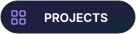
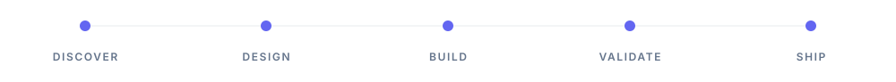
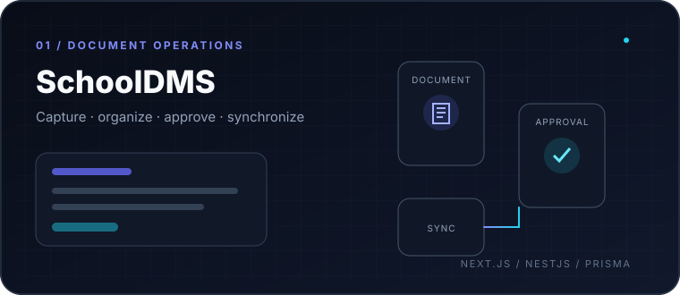
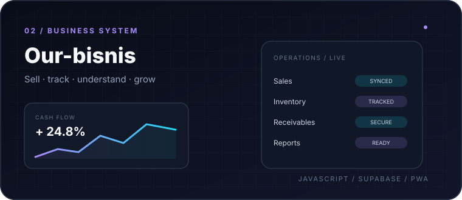
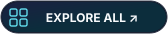
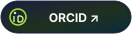
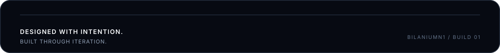

<picture>
  <source media="(prefers-color-scheme: dark)" srcset="./assets/hero-dark.svg">
  <source media="(prefers-color-scheme: light)" srcset="./assets/hero-light.svg">
  
</picture>

 

&nbsp;

&nbsp;

&nbsp;

&nbsp;

  

&nbsp;

&nbsp;

  

Independent developer · Lembang, Indonesia

<!-- AUTO-UPDATED:START -->
Profile data refreshed automatically.
<!-- AUTO-UPDATED:END -->

 

  

## About

I build **useful software with a clean, practical experience**.

My work sits around web applications, automation, document workflows, and business tools. I learn by shipping, refining, and turning small ideas into working products.

  

---

## Featured Work

<table cellspacing="24" cellpadding="0">
<tr>
<td width="50%" valign="top">

  

**SchoolDMS**  
Document workflow system with web, backend, and sync-client components.

 

TypeScript · Web · Backend

  

&nbsp;

</td>

<td width="50%" valign="top">

  

**Our-bisnis**  
Business management platform for sales, stock, transactions, reporting, and PWA usage.

 

JavaScript · Supabase · PWA

  

</td>
</tr>
</table>

---

## Repositories

<!-- AUTO-REPOS:START -->
<table cellspacing="20">
<tr>
<td width="50%" valign="top">

### SchoolDMS

Document management system for school workflows.

`TypeScript` · `Web` · `Backend`

 

</td>

<td width="50%" valign="top">

### Our-bisnis

Business & coffee management platform.

`JavaScript` · `Supabase` · `PWA`

 

</td>
</tr>

<tr>
<td width="50%" valign="top">

### BotIndo

JavaScript automation / bot project.

`JavaScript` · `Node.js`

 

</td>

<td width="50%" valign="top">

### puzzle-mobile

Mobile-focused project.

`Mobile`

 

</td>
</tr>
</table>

  

<!-- AUTO-REPOS:END -->

  

---

## Stack

  

Focused stack · chosen for building and shipping real projects

---

## Activity

  Live contribution activity — no duplicated stats cards, no repeated numbers.

---

## Current Focus

<table cellspacing="0" cellpadding="0">
<tr>
<td width="25%" align="center"><strong>BUILD</strong> Useful web tools</td>
<td width="25%" align="center"><strong>LEARN</strong> Architecture & UX</td>
<td width="25%" align="center"><strong>SHIP</strong> Real-world projects</td>
<td width="25%" align="center"><strong>ITERATE</strong> Small, steady improvements</td>
</tr>
</table>

---

## Connect

&nbsp;

&nbsp;

  

Open to useful collaborations, interesting ideas, and thoughtful software.

 

  <picture>
    <source media="(prefers-color-scheme: dark)" srcset="./assets/footer-dark.svg">
    <source media="(prefers-color-scheme: light)" srcset="./assets/footer-light.svg">
    
  </picture>

