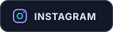

<picture>
  <source media="(prefers-color-scheme: dark)" srcset="./assets/hero-dark.svg">
  <source media="(prefers-color-scheme: light)" srcset="./assets/hero-light.svg">
  
</picture>

 

&nbsp;&nbsp;

  

Independent developer in Lembang, Indonesia &nbsp;·&nbsp; Building practical products for real workflows

## About

I design and build **practical web products**—turning everyday problems into clear interfaces, reliable systems, and maintainable code. My work spans document workflows, business operations, automation, and immersive web experiences.

I care about the details between an idea and a product people can actually use: thoughtful UX, sensible architecture, resilient data flows, and continuous refinement.

  

## Selected Work

### SchoolDMS

A connected document-management platform for school workflows, combining a Next.js interface, NestJS API, Prisma data layer, cloud storage, and sync tooling.

`TypeScript` `Next.js` `NestJS` `Prisma` `Supabase`

[Live product](https://school-dms.vercel.app/) · [Source code](https://github.com/bilanazhmii/SchoolDMS)

 

### Our-bisnis

A PWA for day-to-day business operations: sales, inventory, cash flow, receivables, reports, receipts, roles, and secure cross-device sync.

`JavaScript` `Supabase` `PWA` `RLS` `Offline-first`

[Live product](https://our-bisnis.vercel.app/) · [Source code](https://github.com/bilanazhmii/Our-bisnis)

## More Work

<!-- AUTO-REPOS:START -->
| Project | What it is | Built with |
| :-- | :-- | :-- |
| [**MyPortofolio**](https://github.com/bilanazhmii/MyPortofolio) ↗ | An immersive 3D portfolio with motion, spatial interaction, and a cinematic WebGL experience. [Live ↗](https://myportofolio-bila-la.vercel.app) | `TypeScript` |
| [**BotIndo**](https://github.com/bilanazhmii/BotIndo) ↗ | A Discord and Minecraft operations bot with RCON, server status, commands, AI utilities, and a web dashboard. | `JavaScript` |

<a href="https://github.com/bilanazhmii?tab=repositories">View all repositories →</a>

<!-- AUTO-REPOS:END -->

## How I Build

<table>
<tr>
<td width="33%" valign="top">

**01 / Product clarity**

Start with the real workflow, then remove friction until the experience feels obvious.

</td>
<td width="33%" valign="top">

**02 / System thinking**

Connect interface, API, data, security, and deployment as one coherent product.

</td>
<td width="33%" valign="top">

**03 / Iterative craft**

Ship, observe, refine, and keep the implementation as intentional as the design.

</td>
</tr>
</table>

## Core Stack

  

Product engineering &nbsp;·&nbsp; Frontend systems &nbsp;·&nbsp; Backend APIs &nbsp;·&nbsp; Data workflows &nbsp;·&nbsp; Deployment

## Development Activity

## Current Direction

- Building web products with stronger architecture, accessibility, and product polish.
- Exploring immersive interfaces through React, Three.js, and motion systems.
- Improving automation and secure cloud workflows for real operational needs.

## Connect

If you are building something useful, have an interesting technical problem, or want to exchange ideas, feel free to reach out.

 

[**Portfolio**](https://the-portofolio.vercel.app/) &nbsp;·&nbsp; [**GitHub**](https://github.com/bilanazhmii) &nbsp;·&nbsp; [**Instagram**](https://www.instagram.com/tell.hack/) &nbsp;·&nbsp; [**ORCID**](https://orcid.org/0009-0004-5857-3394)

  

<picture>
  <source media="(prefers-color-scheme: dark)" srcset="./assets/footer-dark.svg">
  <source media="(prefers-color-scheme: light)" srcset="./assets/footer-light.svg">
  
</picture>

