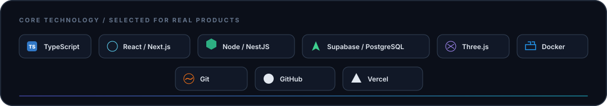

<picture>
  <source media="(prefers-color-scheme: dark)" srcset="./assets/hero-dark.svg">
  <source media="(prefers-color-scheme: light)" srcset="./assets/hero-light.svg">
  
</picture>

 

  

<samp>just missing someone Favorite ☝️✌️N</samp>

## Profile

I’m an independent developer in **Lembang, Indonesia**, designing practical digital products from interface to infrastructure. I work where product thinking, dependable systems, and expressive web experiences meet—turning real workflows into software that feels clear, resilient, and considered.

<table>
<tr>
<td width="33%" valign="top">

<strong>FOCUS / 01</strong> 
Product engineering and workflow design

</td>
<td width="33%" valign="top">

<strong>SYSTEM / 02</strong> 
Frontend, APIs, data, security, and delivery

</td>
<td width="33%" valign="top">

<strong>CRAFT / 03</strong> 
Accessible interfaces with intentional motion

</td>
</tr>
</table>

DISCOVER&nbsp;&nbsp;→&nbsp;&nbsp;DESIGN&nbsp;&nbsp;→&nbsp;&nbsp;BUILD&nbsp;&nbsp;→&nbsp;&nbsp;VALIDATE&nbsp;&nbsp;→&nbsp;&nbsp;SHIP

## Selected Work

### SchoolDMS

Connected document operations for school workflows—combining a Next.js interface, NestJS API, Prisma data layer, cloud storage, approvals, and synchronization.

&nbsp;&nbsp;

TypeScript · Next.js · NestJS · Prisma · Supabase

  

### Our-bisnis

An offline-first PWA for sales, inventory, cash flow, receivables, reporting, receipts, roles, and secure cross-device synchronization.

&nbsp;&nbsp;

JavaScript · Supabase · PWA · RLS · Offline-first

 

<!-- AUTO-REPOS:START -->

<strong>OPEN SOURCE INDEX</strong> · More experiments and systems

 

<table>
<tr>
<td width="50%" valign="top">

<strong>9router</strong> 
A software project from my public workspace.

Open Source

 

</td>
<td width="50%" valign="top">

<strong>Portofolio</strong> 
The current portfolio experience for selected work, capabilities, and an intentionally crafted developer identity.

TypeScript

 &nbsp;

</td>
</tr>
<tr>
<td width="50%" valign="top">

<strong>MyPortofolio</strong> 
An immersive 3D portfolio with motion, spatial interaction, and a cinematic WebGL experience.

TypeScript

 &nbsp;

</td>
<td width="50%" valign="top">

<strong>BotIndo</strong> 
A Discord and Minecraft operations bot with RCON, server status, commands, AI utilities, and a web dashboard.

JavaScript

 

</td>
</tr>
</table>

<!-- AUTO-REPOS:END -->

## How I Build

<table>
<tr>
<td width="33%" valign="top">

**01 / Clarify**

Understand the real workflow and remove friction before adding features.

</td>
<td width="33%" valign="top">

**02 / Connect**

Treat interface, API, data, security, and deployment as one product system.

</td>
<td width="33%" valign="top">

**03 / Refine**

Ship, observe, and improve until the experience and implementation feel intentional.

</td>
</tr>
</table>

## Core Stack

  

Currently exploring stronger architecture, accessible interaction, immersive interfaces, and secure automation.

## Connect

For thoughtful products, unusual technical problems, or a good exchange of ideas.

  

  

<picture>
  <source media="(prefers-color-scheme: dark)" srcset="./assets/footer-dark.svg">
  <source media="(prefers-color-scheme: light)" srcset="./assets/footer-light.svg">
  
</picture>

